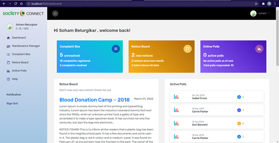

# Society Connect

This project was a part of Software Engineering (CS302)  course where I was able to learn various aspects of SDLC and documentations required such as creating Software Requirements Specification,  UML diagram -Use Case, Class diagram, Interaction Diagrams, Data flow diagram, Work Breakdown Structure, Risk Mitigation, Monitoring and Management Plan (RMMM) and Unit Testing.

#### Housing Society Management Software
All of the society's data is currently stored in physical files, which are vulnerable to damage, loss, and manipulation by anyone. The management of information and effective member communication are challenges for many modern societies. As a result, this data needs to be digitalized. So,  we want to close this gap with the help of our smart web-based Society Management Software, Society Connect (inspired from societyconnect.in)

## Goal
With the help of Society Connect, a Smart Society Management Software, we hope to thoroughly address the issues that complex encounter in the real world and digitalize those services. To maintain excellent communication among society members, it offers online tools like a Notice Board, Maintenance Management, a Virtual Complaint Box, Online Polls, Visitor Management, and other features. 

**Tech Stack**: Django, Django Celery, Celery Beat using Redis server. HTML, Bootstrap, JavaScript

## Screenshots
These are some screenshots of the important pages

### Landing Page:

### Dashboard (Logging in via Owner)
##### All the details that the owner needs such as maintenance, complaint etc are shown.

### Dashboard (Logging in via Tenant)
##### Tenant doesn’t have maintenance information on his dashboard

### Dashboard (Logging in via Committee Member)

### Notice Board
##### Notices are displayed as per the date(latest notice appear first)

### Adding New Notice 
##### Only Committee Members can add and delete Notices

### New Notice Notification Mails
##### As the new notice is added to the Virtual Notice Board, mail is circulated using celery to all the society members to their registered email id.

### Adding Maintenance Bill 
##### Only the Committee Members can add and modify Maintenance Bill details

### Maintenance Bill
##### Maintenance Bills are displayed only to the owners and not to the tenants

### Maintenance Bill Payment
##### Owners of a flat can pay their maintenance bill online using Razor Pay

### Payment Emails
##### Email is sent to the user showing the status of their transaction. These mails are responsive (phone/laptop) and adaptive (dark/light)

### Automatic Reminders
##### Reminder email is sent to the user automatically one day before the deadline of the maintenance bill payment using Celery-Beat.

### Password Reset Email
##### Link to reset user's password sent to the user via email

 

#### This project was done by: 
Adwait Hegde, Yash Jagtap
